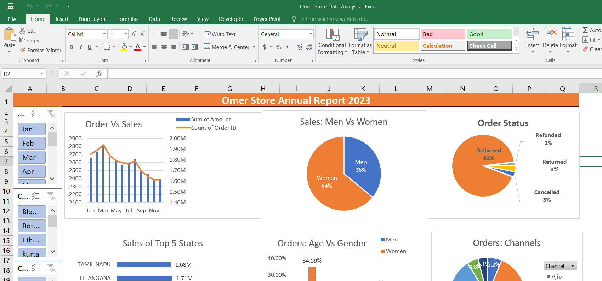

# Store Sales Analysis (Excel)

An annual sales report for a retail store, built entirely in Excel from about 31,000 order records. It turns raw order data into an interactive dashboard that shows who is buying, where, and through which channel.

## Questions answered

- How do sales and order counts change month by month?
- Who buys more, men or women, and in which age groups?
- What share of orders is delivered, returned, refunded or cancelled?
- Which states and sales channels contribute the most?

## Key findings

- Women account for about 64% of sales and men for about 36%
- About 92% of orders are delivered; the rest are returned, cancelled or refunded
- The dashboard also ranks the top five states and compares the sales channels

## How it was built

| Step | Detail |
|---|---|
| Data | About 31,000 orders with customer gender and age, order date, status, channel, category, amount and shipping state |
| Supporting columns | Age group and month columns to support the breakdowns |
| Analysis | Pivot tables for sales and orders, gender, order status, states, age group and channel |
| Dashboard | Pivot charts with slicers for month, category and channel |

## Files

| File | Description |
|---|---|
| `Omer Store Data Analysis Excel project.xlsx` | Workbook with the data, pivot tables and dashboard |
| `dashboard-preview.png` | Preview of the dashboard |
| `Omer Excel Project.png` | Original full-screen capture |

## Tools

Microsoft Excel · Pivot tables · Pivot charts · Slicers

## Author

**Omer Naeem Khan** — Data Analyst
[GitHub](https://github.com/OmerNaeemKhan) · [LinkedIn](https://www.linkedin.com/in/omer-khan-03833749)
